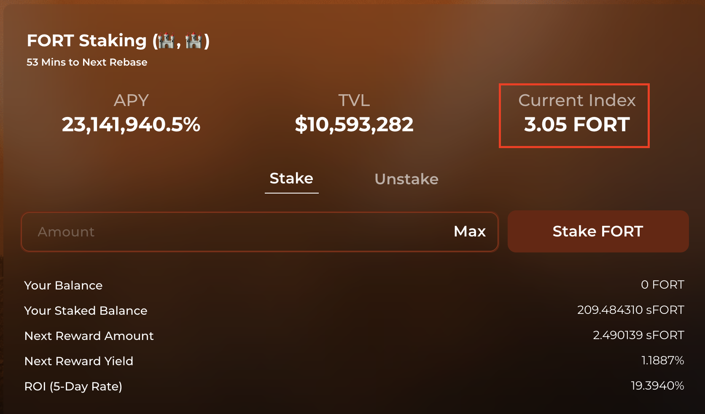

# FAQ

### Why do we need reserve currencies like FORT in the first place?

Dollar-pegged stablecoins have become an essential part of crypto due to their lack of volatility as compared to tokens such as Bitcoin and Ether. Users are comfortable with transacting using stablecoins knowing that they hold the same amount of purchasing power today vs. tomorrow. But this is a fallacy. The dollar is controlled by the US government and the Federal Reserve. This means a depreciation of dollar also means a depreciation of these stablecoins.

Similarly to OlympusDAO, Fortress aims to solve this by creating a free-floating reserve currency, FORT, that is backed by a basket of assets and investments. By focusing on supply growth rather than price appreciation, Fortress hopes that FORT can function as a currency that is able to hold its purchasing power regardless of market volatility.

### How is Fortress different or better than Olympus DAO?

Fortress plans to various investment strategies with our treasury to make its value higher. On top of that, Fortress will offer improvements to the Olympus system, such as the "Zap" function, a profit calculator, and NFTs with future utility. Fortress is also hosted on a faster, more affordable and accessible network Avalanche. Currently, Fortress has a smaller market value and less users than Olympus, providing a much higher potential upside for our project.

### Is FORT a stable coin?

No, FORT is not a stable coin. Rather, FORT aspires to become an algorithmic reserve currency backed by other decentralized assets and investments. Similar to the idea of the gold standard, FORT provides free floating value its users can always fall back on, simply because of the fractional treasury reserves FORT draws its intrinsic value from.

### How do I participate in Fortress? 

There are two main strategies for market participants: [staking](broken-reference) and [minting](broken-reference). Stakers stake their FORT tokens in return for more FORT tokens, while minters provide LP tokens or single tokens in exchange for discounted FORT tokens after a fixed vesting period.

### How do I add Avalanche to my wallet?

To add Avalanche to MetaMask, click on the list of networks at the top of the extension window and select “Custom RPC.” Input the following parameters:

* **Network Name:** Avalanche Network
* **New RPC URL:** [https://api.avax.network/ext/bc/C/rpc](https://api.avax.network/ext/bc/C/rpc)
* **ChainID:** 43114
* **Symbol:** AVAX
* **Explorer:** [https://snowtrace.io/](https://snowtrace.io)

A video tutorial on the above process can be found here: [https://support.avax.network/en/articles/4626956-how-do-i-set-up-metamask-on-avalanche](https://support.avax.network/en/articles/4626956-how-do-i-set-up-metamask-on-avalanche).

### How do I bridge to Avalanche?

The easiest way to add funds to your wallet on Avalanche is to withdraw AVAX (the native token) directly from a centralised exchange (Coinbase, Hotbit, Gate, etc.). You can also bridge from other chains using any of the following popular options:

* **Avalanche Bridge:** [https://bridge.avax.network/](https://bridge.avax.network)
* **Synapse Bridge:** [https://synapseprotocol.com/](https://synapseprotocol.com)
* **AnySwap:** [https://stable.anyswap.exchange/](https://stable.anyswap.exchange)
* **xPollinate:** [https://www.xpollinate.io/](https://www.xpollinate.io)
* **ElkDex:** [https://app.elk.finance/](https://app.elk.finance)
* **cBRIDGE**: [https://cbridge.celer.network/#/transfer](https://cbridge.celer.network/#/transfer)
* **allbridge**: [https://app.allbridge.io/](https://app.allbridge.io)

Please note: you will need AVAX in your wallet to perform transactions on the Avalanche C-Chain. If you bridge non-AVAX funds (USDC, WETH, etc.) onto Avalanche and have no AVAX in your wallet, you will not be able to perform any transactions with those funds.

Currently, there is no “faucet” for the Avalanche chain for supplying small amounts of AVAX. However, if you bridge over more than approximately $75 worth of tokens via the Avalanche Bridge (which only connects the Ethereum mainnet to the Avalanche C-Chain), the bridge will automatically airdrop a small amount of AVAX into your wallet. Another alternative is ElkDex. ElkDex provides the option to swap a small amount of the bridged token into the native chain token for transaction fees.

Once you have successfully transferred funds to the Avalanche network, you will need to swap for the stablecoin MIM in order to participate in Fortress’s LBE. We recommend swapping on the Trader Joe decentralized exchange ([https://traderjoexyz.com/](https://traderjoexyz.com)).

## What is the best strategy for Fortress?

The best strategy for Fortress is known as (🏰, 🏰), similar to (3,3) in OHM, representing minting, and then staking. Why is this the best strategy?

If everyone cooperated in Fortress, it would generate the greatest gain for everyone (from a [game theory](https://en.wikipedia.org/wiki/Game\_theory) standpoint). Currently, there are three actions a user can take:

* Staking (+2)
* Minting (+1)
* Selling (-2)

Staking and minting are considered beneficial to the protocol, while selling is considered detrimental. Staking and selling will also cause a price move, while minting does not (we consider buying FORT from the market as a prerequisite of staking, thus causing a price move). If both actions are beneficial, the actor who moves price also gets half of the benefit (+1). If both actions are contradictory, the bad actor who moves price gets half of the benefit (+1), while the good actor who moves price gets half of the downside (-1). If both actions are detrimental, which implies both actors are selling, they both get half of the downside (-1).

Thus, given two actors, all scenarios of what they could do and the effect on the protocol are shown here:

.png>)

* If we both stake (3, 3), it is the best thing for both of us and the protocol (3 + 3 = 6).
* If one of us stakes and the other one mints, it is also great because staking takes FORT off the market and put it into the protocol, while bonding provides liquidity and DAI for the treasury (3 + 1 = 4).
* When one of us sells, it diminishes effort of the other one who stakes or mints (1 - 1 = 0).
* When we both sell, it creates the worst outcome for both of us and the protocol (-3 - 3 = -6).

## Why is PCV important?

As the protocol controls the funds in its treasury, FORT can only be minted or burned by the protocol. This also guarantees that the protocol can always back 1 FORT with 1 MIM. You can easily define the risk of your investment because you can be confident that the protocol will indefinitely buy FORT below 1 MIM with the treasury assets until no one is left to sell. You can't trust the FED but you can trust the code.

As the protocol accumulates more PCV, more runway is guaranteed for the stakers. This means the stakers can be confident that the current staking APY can be sustained for a longer term because more funds are available in the treasury.

## Why is POL important?

Fortress owns most of its liquidity thanks to its mint mechanism. This has several benefits:

*   Fortress does not have to pay out high farming rewards to incentivise liquidity

    providers a.k.a renting liquidity.
*   Fortress guarantees the market that the liquidity is always there to facilitate

    sell or buy transaction.
*   By being the largest LP (liquidity provider), it earns most of the LP fees which

    represents another source of income to the treasury.
*   All POL can be used to back FORT. The LP tokens are marked down to their risk-free

    value for this purpose. You can read more about the rationale behind this in this

    [Medium article](https://olympusdao.medium.com/dai-bonds-a-more-effective-sales-mechanism-c9a57586f1f7) made by Olympus.

## Why is the market price of FORT so volatile?

It is extremely important to understand how early in development the Fortress protocol is. A large amount of discussion has centered around the current price and expected a stable value moving forward. The reality is that these characteristics are not yet determined. The network is currently tuned for expansion of FORT supply, which when paired with the staking, bonding, and yield mechanics of Fortress, result in a fair amount of volatility.

FORT could trade at a very high price because the market is ready to pay a hefty premium to capture a percentage of the current market capitalization. However, the price of FORT could also drop to a large degree if the market sentiment turns bearish. We would expect significant price volatility during our growth phase so please **do your own research** whether this project suits your goals.

## What is the point of buying it now when FORT trades at a premium?

When you buy and stake FORT, you capture a percentage of the supply (market cap) which will remain close to a constant. This is because your staked FORT balance also increases along with the circulating supply. The implication is that if you buy FORT when the market cap is low, you would be capturing a larger percentage of the market cap.

## What is a rebase?

Rebase is a mechanism by which your staked FORT balance increases automatically. When new FORT are minted by the protocol, a large portion of it goes to the stakers. Because stakers only see staked FORT balance instead of FORT, the protocol utilises the rebase mechanism to increase the staked FORT balance so that 1 staked FORT is always redeemable for 1 FORT.

## What is reward yield?

Reward yield is the percentage by which your staked FORT balance increases on the next epoch. It is also known as _rebase rate_. You can find this number on the [Fortress staking page](https://app.fortressdao.finance/#/stake).

## What is APY? 

APY stands for annual percentage yield. It measures the real rate of return on your principal by taking into account the effect of compounding interest. In the case of Fortress, your staked FORT represents your principal, and the compound interest is added periodically on every epoch (around 8 hours) thanks to the rebase mechanism. One interesting fact about APY is that your balance will grow not linearly but exponentially over time! Assuming a daily compound interest of 2%, if you start with a balance of 1 FORT on day 1, after a year, your balance will grow to about 1377. That is a lot!

## How is the APY calculated?

The APY is calculated from the reward yield (a.k.a rebase rate) using the following equation:

$$
APY = ( 1 + rewardYield )^{1095}
$$

It raises to the power of 1095 because a rebase happens 3 times daily. Consider there are 365 days in a year, this would give a rebase frequency of 365 \* 3 = 1095.

Reward yield is determined by the following equation:

$$
rewardYield = FORT_{distributed} / FORT_{totalStaked}
$$

The number of FORT distributed to the staking contract is calculated from FORT total supply using the following equation:

$$
FORT_{distributed} = FORT_{totalSupply} \times rewardRate
$$

Note that the reward rate is subject to change by the protocol.

## Why does the price of FORT become irrelevant in long term?

As illustrated above, your FORT balance will grow exponentially over time thanks to the power of compounding. Let's say you buy an FORT for $400 now and the market decides that in 1 year time, the intrinsic value of FORT will be $2. Assuming a daily compound interest rate of 2%, your balance would grow to about 1377 FORTs by the end of the year, which is worth around $2754. That is a cool $2354 profit! By now, you should understand that you are paying a premium for FORT now in exchange for a long-term benefit. Thus, you should have a long time horizon to allow your FORT balance to grow exponentially and make this a worthwhile investment.

## What will be FORT's intrinsic value in the future?

There is no clear answer for this, but the intrinsic value can be determined by the treasury performance. For example, if the treasury could guarantee to back every FORT with 100 MIM, the intrinsic value will be 100 MIM. It can also be decided by the DAO. For example, if the DAO decides to raise the price floor of FORT, its intrinsic value will rise accordingly.

## How does the protocol manage to maintain the high staking APY?

Let’s say the protocol targets an APY range of 1,000% to 10,000% (see OIP-18 for more details), this would translate to a _minimum_ reward yield of about 0.2105%, or a daily growth of about 0.6328%. Please refer to the equation above to learn [how APY is calculated from the reward yield](faq.md#how-is-the-apy-calculated).

If there are 100,000 of FORT staked right now, the protocol would need to mint an additional 632.8 FORT to achieve this daily growth. This is achievable if the protocol can bring in at least $632.80 of daily revenue from bond sales. Even if the protocol doesn't bring in that much revenue, it can still sustain 1,000% APY for a considerable amount of time due to the excess reserve in the treasury.

## Do I have to unstake and stake FORT on every epoch to get my rebase rewards?

No. Once you have staked FORT with Fortress, your staked FORT balance will auto-compound on every epoch. That increase in balance represents your rebase rewards.

## How do I track my rebase rewards?

You can track your rebase rewards by calculating the increase in your staked FORT balance.

1.) Record down the Current Index value on the [staking page](https://app.fortressdao.finance/#/stake) when you first stake your FORT. Let's call this the Start Index.

.png>)

2.) After staking for some time, if you want to determine by how much your balance has increased, check the Current Index value again. Let's call this the End Index.

3.) By dividing the End Index by Start Index, you would get the ratio by which your staked FORT balance has increased.

$$
ratio = endIndex / startIndex
$$

4.) In this example, the FORT balance has grown by 2.93 times.

$$
ratio = 3.05/1.04 = 2.93
$$
